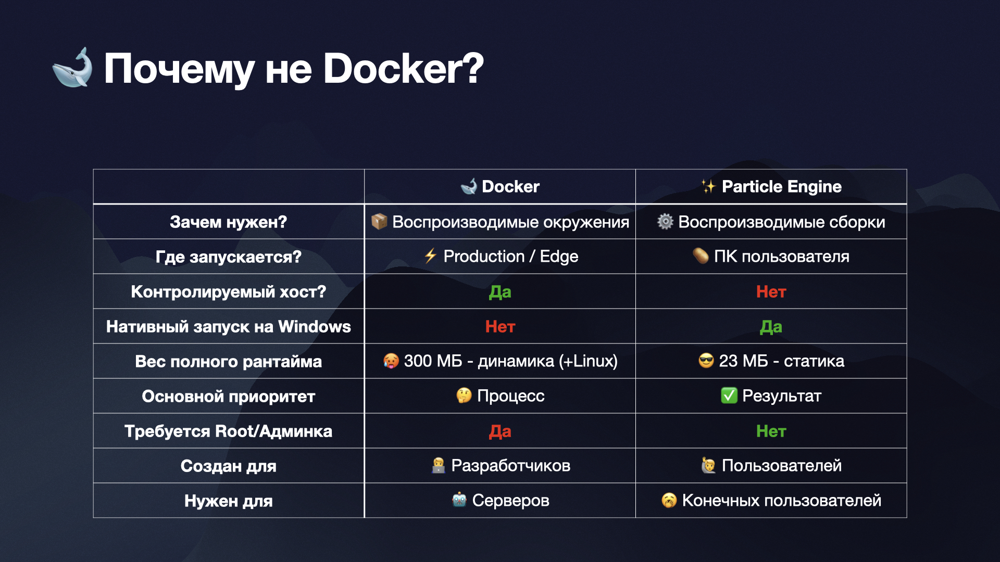

# ✨ Particle Engine
### Воспроизводимые сборки на любом устройстве



### Поддерживаемые архитектуры:

| OS                       | code   |
|--------------------------|--------|
| Windows x64              | `w64`  |
| Linux x64                | `l64`  |
| Linux arm64              | `l64a` |
| macOS x64 10.14+         | `d64`  |
| macOS arm64 11+          | `d64a` |

`w=windows, l=linux, d=darwin`

# Что это и как работает?
Docker отлично работает и всем нравится, но иногда нужно что-то собрать на
устройстве пользователя - и тут уже 99% Windows без админки и прочей радости.
Завозить на компы юзеров полноценный WSL и Docker Desktop ради выполнения
простого рецепта - тупо. Так и появился Particle Engine ✨

Если кратко, то это билдер, использующий 3 важных элемента:
1. **Runner** - Linix-like окружение, унифицирующее сборки на MacOS, Windows и Linux.
Присутствует в двух вариантах: thin и full.
    > **Thin** - легковесное busybox окружение, которое просто привносит стандартные Linux утилиты
начиная от cp и cat заканчивая wget на Windows. Сам эмулятор bash весит порядка 600кб, а
на Linux и MacOS использует системную оболочку. Изоляции нет
   
    > **Full** - полное Arch Linux окружение, запускаемое через MSYS2 или chroot (позже для rootless 
будет proot). Предоставляет кучу пакетов, которые хоть и отличаются в linux и windows реализациях,
но зато гарантированно ставятся в изоляции и доступны даже пользователям без админ-прав.
Arch по причине того, что debian-like оболочек под винду нет

2. **Layer** - слои с данными, которые накладываются друг на друга. Менее элегантно, чем OverlayFS,
но и я сам недавно узнал, что даже символьные ссылки на Windows из коробки не работают.

3. **Recipe** - рецепт, по которому надо собрать партикл. Он определяет какие слои нужно просто распаковать, 
какие содержат выполняемые скрипты, что это будут за скрипты, переменные окружения, оверрайды и еще куча всего

## Структура рецепта
Language: [YAML](https://gopkg.in/yaml.v3)
```yaml
name: author/particle_name@v2

meta:
    author: "Particle Author"
    note: "Short note"

layer:
    block: "[sha256 autogen]"
    server: "http://optional.com/v1"

recipe:
    - use: rigby/gd_android@2.2
    - apply: https://someothermod.xyz/particles/fifuser/gd_patcher
      env:
        KAFIF: YES
      command: overriden

runnable:
  runner: "full"
  build:
    - run: |
        command -arg value
    - copy: "$MOD/file1"
      to: "$BUILD/file2"
```

Теперь разберем рецепт по порядку
- **name** - автор/название@версия партикла, с которыми он отправится в хаб 
при публикации
- **meta** - глобальные переменные окружения для всех этапов сборки, также
используются как метаданные
- **layer** - всякая информация о связанном с рецептом слое, менять стоит только server в редких случаях
- **recipe** - собственно рецепт, который надо собрать
    > Мы собираем сборку, которая называется партиклом (т.е. частицей), которая состоит из
других партиклов: пассивных слоев (usables) и активных слоев (runnables/appliances).
    > * Пассивный слой - просто архив, который надо распаковать в папку билда (даже если в нем есть скрипты) -
такие мы указываем в `use:`
    > * Активный слой - скрипты, которые надо запустить в окружении билда. Такие мы указываем в `apply:` и 
можем докидывать переменные окружения с помощью `env:`, а также изменить команду для запуска (см. [Паттерн Builder](#паттерн-builder))
- **runnable** - опциональный блок для активного партикла (runnable/appliance)
    > * **runner** определяет какой раннер скрипту нужен, если в рецепте есть хоть один раннер `full`, то он
будет использоваться для всех активных слоев (cp cat и прочие простые команды есть и в арче, никто не умрет)
    > * **build** - определяет какие команды надо запускать в окружении билда или какие файлы/папки надо копировать
(в оболочку добавляются две переменные окружения: `$BUILD` - путь до билда, `$MOD` - путь до модуля, т.е. папки со всеми
файлами активного слоя). `copy-to` использует простой `cp -r`

### Окружение билда
```
/build * <-- тут сам билд
/dev
/etc
/home
/opt
/runnable *
     ---> /<runnablename>   <-- тут активный слой
/tmp
     ---> /buildcache
/usr
/var
integrity.json
```

# Использование
```
Usage: particle <command> [args]

Commands:
	init		Initializes blank particle directory
	build		Builds particle from manifest
	package		Packages particle after build and modifications
	enter		Enters particle environment shell
	export		Exports particle distribution
	auth		Logs you into remote repository account
	publish		Publishes your particle to remote repository
	serve		Starts local repository webserver (see help)

Other commands:
	pull 		Pulls particle and it's dependencies from remote repository without building it
	local		Manages local particles
	version		Prints version
```

### 1. Инициализация пустого партикла
```shell
particle init <dir>
```

### 2. Сборка рецепта
Сначала редактируете рецепт в файле `dir/particle.yaml`
```shell
particle build <dir>
```
Или если вы уже знаете, что рецепт рабочий и нужно быстро создать сборку без мусора:
```shell
particle build -export -clean <dir>
```
Я это называю OneShot-сборкой

### 3. Модификация сборки
Войти в окружение сборки:
```shell
particle enter <dir>
```
Дальше делаете что нужно и выходите через `exit`

### 4. Упаковка сборки
```shell
particle package <dir>
```

### 5. Публикация сборки
```shell
particle publish <dir>
```
Не забудьте заглянуть в помощь для подробностей (`particle publish -h`)

Чтобы опубликовать - надо будет войти в аккаунт ParticleHub через
```shell
particle auth -a <username> -t <token>
```
Укажите `-u` если у вас свой сервер

## Паттерн Builder
Суть паттерна в том, что вы используете `apply: core/builder` или `apply: core/builder_lite` вместе с указанием команд для того, 
чтобы выполнять всякие команды как рецепт сборки. 

Бояться arch-chroot ниже не стоит, он здесь потому что мы создаем 
arch-окружение внутри окружения самого билда, так как chroot сам себя не запакует

Вот так допиливался арч.
```yaml
name: core/builder_aur
meta:
  author: username
  note: Short note
layer:
  block: 3005c52f7a0e3b23ff034649f19f91f6f8a7bf21fc3a533a5ea86dc978549c2c
recipe:
  - use: core/fullrunner
  - apply: core/builder_lite
    command: |
      tar --strip-components=1 -xf $BUILD/archlinux-bootstrap-x86_64.tar.zst -C $BUILD --numeric-owner && \
      rm $BUILD/archlinux-bootstrap-x86_64.tar.zst
  - apply: core/builder_lite
    command: |
      echo Preparing base arch...
      $BUILD/bin/arch-chroot $BUILD /bin/bash -lc "pacman-key --init && \
      pacman-key --populate && sed -i 's/CheckSpace/#CheckSpace/' /etc/pacman.conf && \
      echo 'Server = https://geo.mirror.pkgbuild.com/\$repo/os/\$arch' >> /etc/pacman.d/mirrorlist && \
      pacman -Sy --noconfirm --noprogressbar"
  - apply: core/builder_lite
    command: |
      echo Installing packer...
      $BUILD/bin/arch-chroot $BUILD /bin/bash -lc "pacman -S --noconfirm --noprogressbar base-devel jshon expac git wget && \
      wget -q https://aur.archlinux.org/cgit/aur.git/plain/PKGBUILD?h=packer && mv PKGBUILD\?h\=packer PKGBUILD && \
      sed -i 's/exit \$E_ROOT/#/' \$(which makepkg) && makepkg && pacman -U --noconfirm --noprogressbar packer-*.pkg.* && \
      sed -i 's/--asroot//' \$(which packer) && rm PKGBUILD && rm packer-*.pkg.*"
  - apply: core/builder_lite
    command: |
      echo "Building core/builder_aur..."
      tar -zcf $BUILD/../archlinux-bootstrap-x86_64.tar.zst build || true && \
      rm -rf $BUILD/* && mv $BUILD/../archlinux-bootstrap-x86_64.tar.zst $BUILD
```

### Кастомные окружения
Только Linux, не рекомендуется так делать. Но если очень надо, то в рецепте требуем полное окружение и делаем так:
```shell
export PARTICLE_FULLRUNNER=core/builder_aur@latest
```

